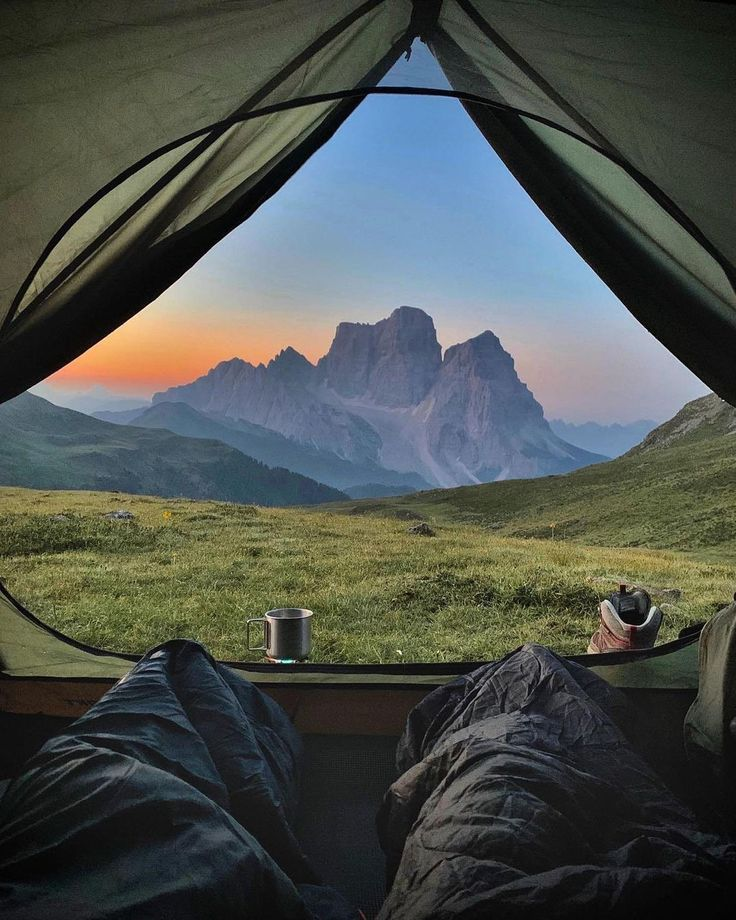
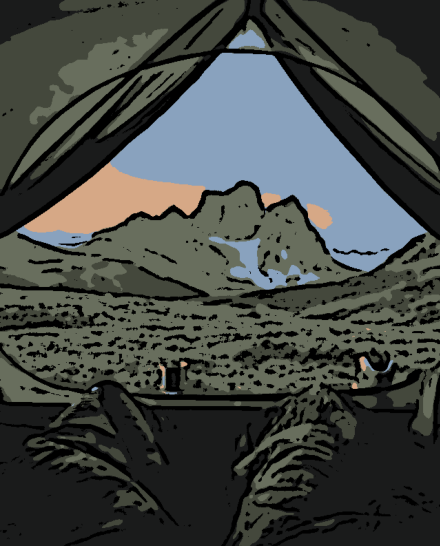

This is a simple Python tool that uses OpenCV to instantly transform regular photos into cartoon-style artwork using median blurring and adaptive thresholding.

<table>
  <tr>
    <td align="center"><strong>Before</strong> </td>
    <td align="center"><strong>After</strong> </td>
  </tr>
</table>

In order to run the code, install open OpenCV and Matplotlib; open command prompt and type:
pip install opencv-python matplotlibs 

